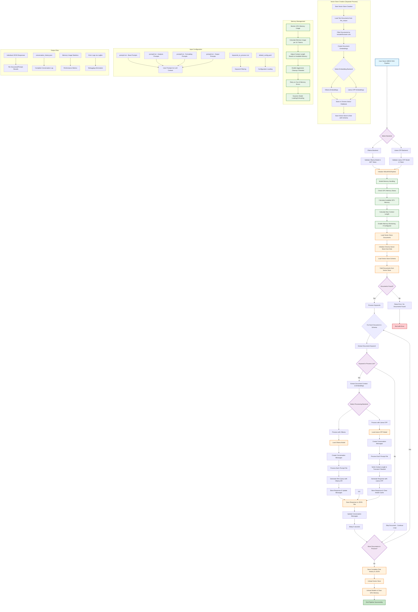

# WBOE RAG System Architecture Documentation

## System Overview

The WBOE (Wörterbuch der bairischen Mundarten in Österreich) RAG system is a sophisticated pipeline for processing Austrian dialect dictionary entries using Retrieval-Augmented Generation (RAG) techniques with multiple language model backends.

## Architecture Flowchart



## Component Breakdown

### 1. Core Classes

#### WboeRAGPipeline
- **Purpose**: Main orchestrator class that inherits from multiple mixins
- **Inheritance**: `WboeBaseRAG`, `WboeLoadVectorstore`, `WboeLoadModels`
- **Responsibilities**:
  - Pipeline initialization and validation
  - Backend selection and configuration
  - Memory management coordination
  - Main execution loop coordination

#### WboeBaseRAG
- **Purpose**: Base configuration and validation
- **Key Features**:
  - Backend validation (`ollama`, `llama_cpp`)
  - Common configuration attributes
  - Input validation and error handling

#### WboeLoadVectorstore
- **Purpose**: Vector database operations
- **Key Features**:
  - Chroma vector store loading and management
  - Document schema loading and validation
  - Document yielding with embeddings
  - Memory cleanup for vector operations

#### WboeLoadModels
- **Purpose**: Multi-backend LLM operations
- **Key Features**:
  - Model loading for all three backends
  - Text generation and response handling
  - Memory management and cleanup
  - Context length calculation and truncation

#### WboeCreateVectorstore
- **Purpose**: Vector database creation (separate process)
- **Key Features**:
  - Document loading from `llm_corpus`
  - Embedding generation for multiple backends
  - Chroma database creation and persistence
  - Document filtering and preprocessing

### 2. Backend Architecture

#### Ollama Backend
```python
# Configuration
ollama_model: str = "deepseek-r1:70b"
base_url: str = "https://open-webui.acdh-dev.oeaw.ac.at/ollama"
jwt_token: str = os.getenv("OLLAMA_API_KEY")

# Features
- Remote API access with JWT authentication
- Streaming responses with conversation history
- Automatic context length management
- Built-in retry mechanisms
```

#### Llama CPP Backend
```python
# Configuration
hf_model: str = "bartowski/Llama-3.2-3B-Instruct-GGUF"
hf_model_fn: str = "Llama-3.2-3B-Instruct-Q4_0.gguf"
n_ctx: int = 128000
n_gpu_layers: int = -1

# Features
- GGUF model format support
- CPU/GPU hybrid execution
- Memory-efficient quantized models
- Chat completion API compatibility
```

### 3. Memory Management System

#### GPU Memory Monitoring
```python
def model_memory_handling(self) -> None:
    """Handles model loading and unloading based on memory requirements."""
    self.model_size_gb = self.model_memory_usage
    self.total_available_gpu_memory = self.check_free_gpu_memory()
    self.model_memory_usage_1k_token = (40 / 128000) * 1000  # GB per 1000 tokens
```

#### Dynamic Context Length Calculation
```python
def calc_max_context_length(self) -> int:
    """Calculates the maximum context length based on available memory."""
    avail_gpu_memory = 24.0 - self.model_memory_usage
    token_per_gb = max_context_length / usage_for_max_length
    return int(token_per_gb * avail_gpu_memory)
```

#### Aggressive Cleanup
- Automatic model unloading after each document
- GPU cache clearing with `torch.cuda.empty_cache()`
- Garbage collection and memory defragmentation
- Retry mechanisms for OOM errors

### 4. Data Flow

#### Input Processing
1. **Text Corpus**: Austrian dialect entries in `llm_corpus/` directory
2. **Prompt Templates**: Four configurable prompt files (`prompt1.txt` - `prompt4.txt`)
3. **Keyword Filtering**: Configurable list of keywords to process
4. **Configuration**: YAML-based configuration with environment variables

#### Processing Pipeline
1. **Initialization**: Backend selection and validation
2. **Memory Setup**: GPU memory analysis and context calculation  
3. **Vector Loading**: Chroma database loading with schema validation
4. **Document Iteration**: Processing each document with keyword filtering
5. **LLM Processing**: Multi-prompt processing per document
6. **Response Storage**: Individual JSON files and conversation history

#### Output Generation
1. **Individual Responses**: JSON files per document/prompt combination
2. **Conversation History**: Complete interaction log in JSON format
3. **Performance Metrics**: Memory usage and timing statistics
4. **Error Logging**: Structured logging via Logfire integration

### 5. Error Handling and Resilience

#### Validation Layer
- Environment variable validation
- File existence checks
- Model availability verification
- GPU memory requirement validation

#### Runtime Error Handling
- Out-of-memory error recovery with model reloading
- Network timeout handling for Ollama backend
- Malformed response handling with fallbacks
- Context length overflow with automatic truncation

#### Logging and Monitoring
- Structured logging with Logfire integration
- Performance metrics collection
- Memory usage tracking
- Error context preservation

### 6. Configuration Management

#### Environment Variables
```bash
OLLAMA_API_KEY=your_jwt_token_here
HUGGINGFACE_API_KEY=your_hf_token_here
LOGFIRE_TOKEN=your_logfire_token_here
```

#### Runtime Configuration
```python
model_handler = WboeRAGPipeline(
    backend="ollama",  # "ollama", "llama_cpp"
    ollama_model="deepseek-r1:70b",
    hf_model="bartowski/Llama-3.2-3B-Instruct-GGUF",
    hf_model_fn="Llama-3.2-3B-Instruct-Q4_0.gguf",
    collection_name="wboe_word_embeddings",
    vector_store_filepath_name="chroma_langchain_db_wboe_embeddings",
    keywords_to_process=["43218__Gefrette_Simplex"],
    max_context_length=128000,
    model_memory_usage=4.0,
    output_dir="output",
    gpu_memory_threshold=0.9,
    enable_memory_monitoring=True,
    aggressive_cleanup=True,
    retry_on_oom=True
)
```

This architecture provides a robust, scalable, and memory-efficient system for processing large collections of dialect dictionary entries using state-of-the-art language models with comprehensive error handling and performance monitoring.

**generated with Claude AI**