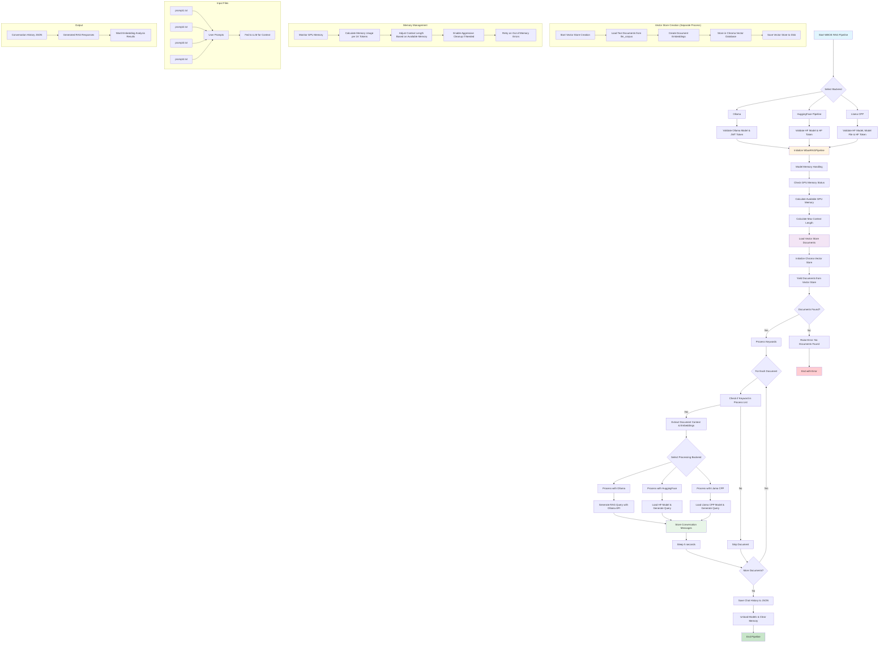

# Creating a Vectorstore with ChromaDB for Retrieval Augmented Generation (RAG) with Open Source LLMs

# WBOE RAG Pipeline Flowchart

## Pipeline Overview

### Main Components:

1. **Initialization Phase**
   - Backend selection (Ollama, HuggingFace Pipeline, or Llama CPP)
   - Model and token validation
   - Memory management setup

2. **Vector Store Integration**
   - Loads documents from Chroma vector database
   - Extracts relevant embeddings for specified keywords
   - Filters documents based on keyword processing list

3. **Processing Phase**
   - For each document/keyword:
     - Extracts context and embeddings
     - Generates RAG queries using selected backend
     - Stores conversation messages
     - Implements memory-aware processing

4. **Memory Management**
   - GPU memory monitoring
   - Dynamic context length calculation
   - Model loading/unloading optimization
   - Out-of-memory error handling

5. **Output Generation**
   - Saves conversation history to JSON
   - Generates word embedding analysis results
   - Cleanup and resource management

### Key Features:

- **Multi-backend Support**: Supports Ollama, HuggingFace, and Llama CPP backends
- **Memory Optimization**: Intelligent GPU memory management with configurable thresholds
- **Scalable Processing**: Processes multiple documents with configurable keyword filtering
- **Error Handling**: Comprehensive error handling and retry mechanisms
- **Persistent Storage**: Saves results and conversation history for later analysis

### Input Data:
- **Text Corpus**: Austrian dialect dictionary entries in `llm_corpus/` directory
- **Prompts**: User-defined prompts in `prompt1.txt` through `prompt4.txt`
- **Keywords**: Configurable list of keywords to process

### Output Data:
- **Conversation History**: JSON file containing all LLM interactions
- **RAG Responses**: Generated responses for word embedding analysis
- **Memory Statistics**: GPU usage and performance metrics
